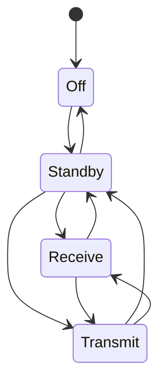

# Tactical Radio Simulator

A multithreaded C++20 simulation of tactical radio stations communicating over
a shared channel. Each radio enforces an operating-mode state machine and
validated settings; each station receives traffic on its own thread, and only
hears transmissions when it is in Receive mode on the matching frequency.

The project focuses on the core problems of radio control software: state
machines, input validation, thread-safe shared state, and message passing
between concurrent components, all covered by unit tests and checked for data
races with ThreadSanitizer.

> This is an educational simulation. It does not model real RF propagation,
> waveforms, or any real product.

## Demo

```
$ ./build/radio_sim
Radio simulator starting

Alpha (100 MHz): "Bravo, this is Alpha. Radio check, over."
  Bravo heard it
  Charlie heard nothing

Bravo (100 MHz): "Alpha, this is Bravo. Loud and clear, over."
  Alpha heard it
  Charlie heard nothing

Alpha (100 MHz): "All stations, this is Alpha. Net check, out."
  Bravo heard it
  Charlie heard it

Radio simulator stopping
```

Alpha and Bravo share 100 MHz while Charlie listens on 250 MHz, so Charlie
misses the first two transmissions. Charlie then retunes to 100 MHz and hears
the third.

## Features

**Radio state machine.** Each radio is in one of four modes, and only these
transitions are allowed (anything else is rejected):



| From | Allowed next modes |
|---|---|
| Off | Standby |
| Standby | Off, Receive, Transmit |
| Receive | Standby, Transmit |
| Transmit | Standby, Receive |

**Validated settings.**
- Frequency: 30–512 MHz, changeable only in Standby (settings are locked while
  receiving or transmitting). NaN is rejected.
- Transmit power: levels 1–5.
- Every setter returns `true` if the change was applied and `false` if it was
  rejected, leaving the radio unchanged.

**Thread-safe radio.** All `Radio` operations hold a mutex for their full
duration, so check-then-act sequences ("is the radio in Standby? then retune")
can't be interrupted by another thread. `Radio::status()` returns a consistent
snapshot of all settings in one call.

**Message passing between stations.**
- `MessageQueue`: a blocking FIFO queue built on `std::mutex` and
  `std::condition_variable`. Consumers sleep until a message arrives instead
  of polling, and `close()` wakes them for a clean shutdown.
- `Channel`: the shared "air." It delivers a copy of each transmission to
  every other station.
- `Station`: a radio plus an inbox and a receive thread. The thread is started
  in the constructor and stopped and joined in the destructor (RAII), so a
  station can never leave a running thread behind.

## Architecture

```
                Channel ("the air")
       ┌───────────────┼───────────────┐
   MessageQueue    MessageQueue    MessageQueue      one inbox per station
       │               │               │
  receive thread  receive thread  receive thread     hears a message only in
       │               │               │             Receive mode on the
     Alpha           Bravo          Charlie          matching frequency
   (Station)       (Station)       (Station)
```

| Component | Header | Responsibility |
|---|---|---|
| `Radio` | [include/radio.h](include/radio.h) | Mode state machine, frequency and power validation, thread-safe access |
| `MessageQueue` | [include/message_queue.h](include/message_queue.h) | Blocking thread-safe FIFO with shutdown |
| `Channel` | [include/channel.h](include/channel.h) | Broadcasts each transmission to every other station |
| `Station` | [include/station.h](include/station.h) | Owns a radio, an inbox, and a receive thread |

### Design notes
- **Deny by default.** The mode state machine starts from "not allowed" and
  only permits transitions it explicitly lists. A missing rule rejects a change
  instead of silently allowing it. The `switch` has no `default` case, so the
  compiler warns if a new mode is added without rules.
- **Consistent lock ordering.** Locks are always taken in the order
  Channel → MessageQueue, and never the reverse, which rules out deadlock
  between them.
- **Asynchronous delivery.** `transmit()` returns immediately and stations
  process messages on their own threads. Tests synchronize with
  `Station::waitUntilProcessed()` instead of sleeping, so they're fast and
  deterministic.

## Testing

26 GoogleTest tests cover:
- every rule of the mode state machine and the setting validation, including
  range boundaries (30/512 MHz accepted, 29.9/512.1 rejected) and NaN;
- concurrent access to one `Radio` from multiple threads;
- queue ordering, blocking `pop()`, shutdown via `close()`, and 4 producers
  delivering 4,000 messages to one consumer with none lost;
- station behavior: same frequency heard, different frequency or wrong mode
  dropped, sender doesn't hear itself, every listener gets its own copy.

Every test has a 10-second timeout, so a deadlock fails the test instead of
hanging the run. The full suite also runs under **ThreadSanitizer**, which
reports any data race with the exact lines involved.

## Building and running

Developed and tested on macOS with Apple Clang.

**Requirements:**
- Xcode Command Line Tools (provides Apple Clang): `xcode-select --install`
- CMake 3.24 or newer: `brew install cmake`

GoogleTest is downloaded automatically by CMake the first time you configure,
so an internet connection is needed on that first run.

```sh
cmake -S . -B build                          # configure
cmake --build build                          # build
./build/radio_sim                            # run the demo
ctest --test-dir build --output-on-failure   # run the tests
```

### Checking for data races (ThreadSanitizer)

```sh
cmake -S . -B build-tsan -DRADIO_SIM_ENABLE_TSAN=ON
cmake --build build-tsan
ctest --test-dir build-tsan --output-on-failure
```

Any race is printed as `WARNING: ThreadSanitizer: data race`, with the file
and line of both conflicting accesses, and the affected test fails. Run the
tests through `ctest` as shown: running the test binary directly still prints
`PASSED` when a race is found, so warnings are easy to miss.

## Project layout

```
include/   Headers: Radio, MessageQueue, Channel, Station
src/       Implementations and the demo (main.cpp)
tests/     GoogleTest unit and concurrency tests
```

## Roadmap

- [x] Radio mode state machine with validated settings
- [x] Thread-safe radio, verified with ThreadSanitizer
- [x] Thread-safe message queue and multi-station channel
- [ ] Continuous integration (build, tests, and ThreadSanitizer on every push)
- [ ] Channel presets: save and recall named frequency and power settings
- [ ] Frequency hopping on a shared pseudo-random schedule
- [ ] Message framing with CRC error detection
- [ ] Simulated channel noise and packet loss
